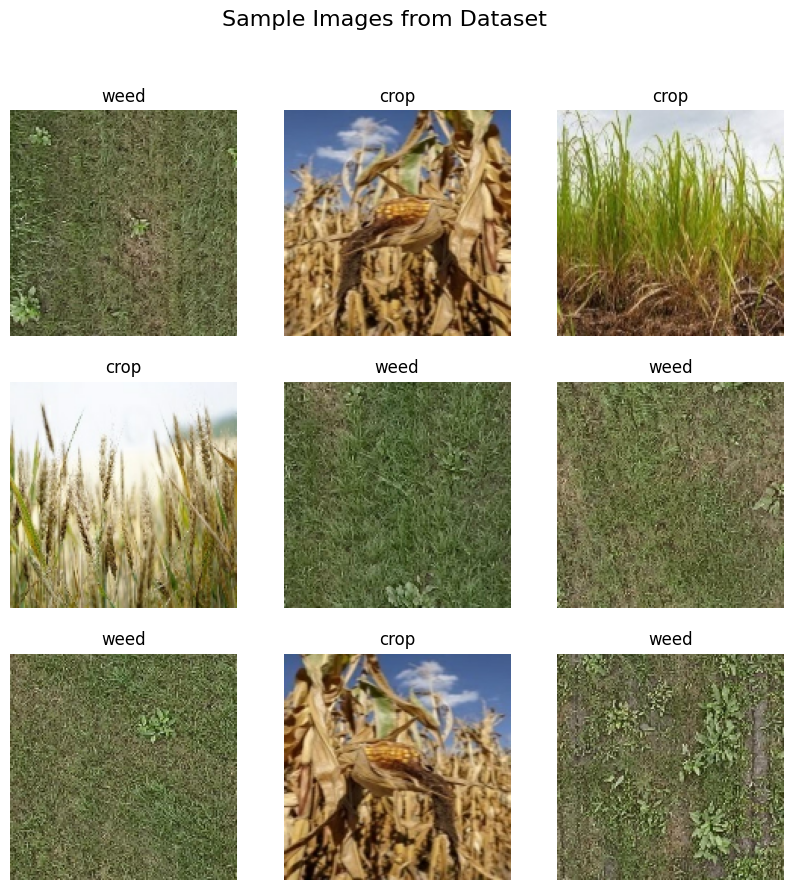
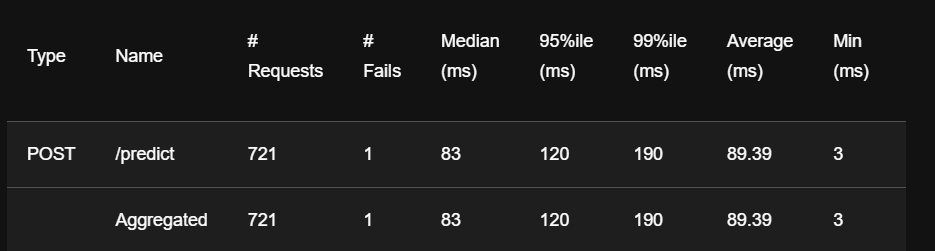

 Crop vs. Weed Identification API and Web Application

This project deploys a Machine Learning model for identifying 'Crop' or 'Weed' in an image using a microservice architecture built with FastAPI (for the prediction API) and Streamlit (for the front-end application). The entire stack is containerized using Docker Compose for easy, consistent deployment.

The application also includes a background retraining endpoint, allowing the model to be updated with newly uploaded data.


##  Demo Video

A short demo has been recorded to showcase how the system works end-to-end:

 **Demo Link:** [Watch Here](https://youtu.be/sjKvj4LC3d4)

The video covers:
- API prediction workflow  
- Streamlit UI usage  
- Uploading training data  
- Triggering retraining  
- System architecture overview  


## Project Architecture

| Component      | Technology            | Role                                                     | Port |
|----------------|------------------------|-----------------------------------------------------------|------|
| Backend (API)  | FastAPI, TensorFlow/Keras | Serves predictions and handles retraining/data upload. | 8000 |
| Frontend (UI)  | Streamlit             | Provides the user interface for image upload and result display. | 8501 |
| Load Testing   | Locust                | Used to simulate user traffic and test API performance.  | 8089 |

## Prerequisites

Before deployment, ensure you have the following installed on your system:

- **Docker Desktop** – includes Docker Engine and Docker Compose  
- **Git** – for version control and cloning the repository


 ##  Project Structure

This structure ensures all volume mounts in docker-compose.yml work correctly:

```markdown
    .
    ├── src/                     # Backend Python files
    │   ├── api.py               # FastAPI app definitions
    │   ├── train.py             # Retraining pipeline
    │   ├── preprocessing.py     # Image processing utility
    │   └── __init__.py          # Makes 'src' a Python package
    ├── models/                  # Volume for the ML model
    │   └── crop_weed_model.h5   # The trained model file (CRUCIAL)
    ├── data/                    # Volume for training data
    │   └── train/
    ├── ui/
    │   └── app.py               # Streamlit front-end app
    ├── docker-compose.yml
    ├── Dockerfile
    └── Dockerfile.ui

## DATSET EXPLORATION AND MODEL TRAINING VISUALS

##  Sample Images

Below are example images from each class in the dataset:
```




##  Training Curves and Confusion Matrix


```


##  Insights From Dataset Exploration

- The dataset is visually well-separated between crop and weed images.  
- Preprocessing increases consistency and improves training quality.  
- No major class imbalance if both classes have similar counts.  
- Training curves help identify underfitting/overfitting and guide retraining.  

---


## Setup and Deployment

Step 1: Clone the Repository

Clone this repository and change into the project directory:

git clone: [REPO Here](https://github.com/elyse003/Crop_Weed_Project_MLops.git)


Step 2: Ensure Model Availability

You must place a pre-trained crop_weed_model.h5 file inside the ./models directory for the API to start successfully.

Step 3: Deploy with Docker Compose

Run the following command in your project root to build the images and start both the FastAPI and Streamlit containers in the background:

# The --build flag forces the images to be rebuilt with the latest code
docker-compose up --build -d


Step 4: Verify Deployment Status

Check that both containers are running:

docker ps


The output should show ml_api_container and ml_ui_container with status Up.

## Usage and Testing

1. Web Application (Streamlit UI)

Access the front end to upload images and view predictions.

URL: http://localhost:8501

2. FastAPI Endpoints (Swagger UI)

Access the interactive API documentation to test the backend directly.

URL: http://localhost:8000/docs

Key Endpoints to Test:

| Endpoint   | Method | Purpose                                      |
|-----------|--------|----------------------------------------------|
| /         | GET    | Health Check (should return `{"model_loaded": true}`) |
| /predict  | POST   | Uploads image and returns ML classification. |
| /retrain  | POST   | Triggers the background retraining process.  |


3. Load Testing (Locust)

If you have test images prepared in your local directory, you can run the load test to evaluate performance.

Run the Locust command from your project root:

locust -f locustfile.py --host=http://localhost:8000


Access the Locust UI: http://localhost:8089

Start a swarm (e.g., 50 users) and monitor the API's performance and stability.


```


```

## AUTHOR
 Marie Elyse Uyiringiye

